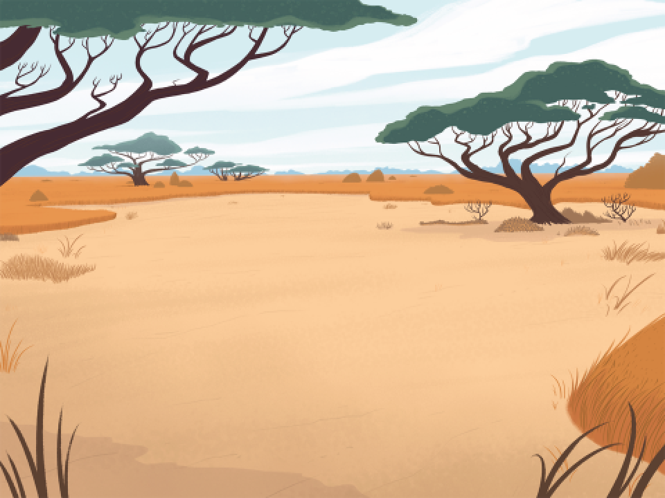
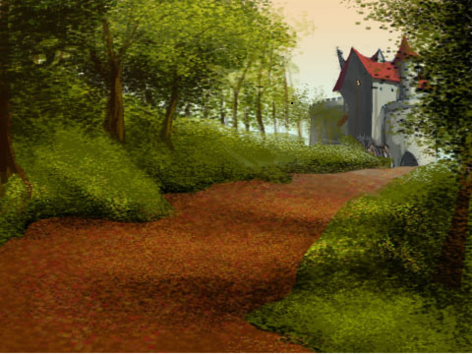

# 🐱 Flying Cat

<p align="center">
  
</p>

<p align="center">
  
  
  
  
</p>

---

An arcade-style, lightweight web browser game inspired by classic tap-to-fly mechanics. Dodge obstacles, balance mid-air momentum, and beat your highest score using vector sprites, sound effects, and pure vanilla web tech[cite: 1].

---

## 🎮 Gameplay & Visuals

<p align="center">
  
</p>

* **One-Tap Flight:** Tap or press space to apply upward impulse against continuous gravity.
* **Obstacle Navigation:** Clear vertical barriers without clipping borders to score points.
* **Audio Cues:** Built-in `.wav` sound effects trigger during key events like flapping and impacts[cite: 1].

---

## 🕹️ Controls

| Platform | Action | Key / Gesture |
| :--- | :--- | :--- |
| **Desktop** | Jump / Flap | `Spacebar` or `Up Arrow (↑)` |
| **Desktop** | Jump / Flap (Mouse) | `Left Click` |
| **Mobile / Tablet** | Jump / Flap | Single Tap on Screen |
| **All** | Restart Game | Tap Screen or press `Spacebar` |

---

## 📂 Project Architecture

```
Flying-cat-main/
├── .vscode/
│   └── settings.json                     # Workspace configuration
├── assets/
│   ├── 080f4d4ec00d14e7b5cf15a8119b5b89.svg  # Vector sprite element
│   ├── 48f7fd9983207c9e4ee0d8804797187b.svg  # Vector sprite element
│   ├── 6667936a2793aade66c765c329379ad0.svg  # Vector sprite element
│   ├── 6be91afcb6160308089e763a5dcf9416.svg  # Vector sprite element
│   ├── 7306886c394c9e33d4441bff460b2e04.svg  # Vector sprite element
│   ├── 83a9787d4cb6f3b7632b4ddfebf74367.wav  # Sound effect (collision/flap audio)
│   ├── 951765ee7f7370f120c9df20b577c22f.png  # Raster game graphic
│   ├── 9b020b8c7cb6a9592f7303add9441d8f.png  # Character/UI banner image
│   ├── 9d2c859a2f1cb2d83fad9750db654292.svg  # Vector sprite element
│   ├── a1ab94c8172c3b97ed9a2bf7c32172cd.svg  # Vector sprite element
│   ├── e85305b47cfd92d971704dcb7ad6e17b.svg  # Vector sprite element
│   └── project.json                      # Sprite definitions and coordinate metadata
├── index.html                            # Main HTML structure and Canvas container
├── script.js                             # Engine loop, event listeners, physics, and rendering
└── README.md                             # Documentation
```
*(All directory structures reflect the core repository contents[cite: 1]).*

---

## 🚀 Quickstart

### Prerequisites
A modern browser such as Google Chrome, Mozilla Firefox, Microsoft Edge, or Safari.

### Running Locally

Because assets and media files are loaded directly via script, opening `index.html` via `file:///` may be restricted by your browser's CORS security policy[cite: 1]. Use a local server instead:

* **VS Code Live Server:**  
  Right-click `index.html` and select **Open with Live Server**[cite: 1].

* **Python 3:**
  ```bash
  python -m http.server 8000
  ```
  Visit `http://localhost:8000` in your browser[cite: 1].

* **Node.js (`npx`):**
  ```bash
  npx serve .
  ```

---

## 🛠️ Modding & Customization

* **Game Physics:** Edit `script.js` to adjust values for downward gravity, flap lift strength, horizontal obstacle speed, and collision boxes[cite: 1].
* **Graphics:** Swap files in the `assets/` directory with matching file names to update the cat avatar or obstacle art[cite: 1].
* **Sounds:** Replace `83a9787d4cb6f3b7632b4ddfebf74367.wav` with your preferred audio file[cite: 1].

---

## 📜 License

This project is open-source and available under the [MIT License](LICENSE).
